# Pluggable One-Class Guided AdaptNAS-Combined Framework

This note rewrites the `adaptnas_combined` framework diagram so that it matches the current implementation in the repository while staying compact enough for paper/thesis use.

## Paper-Ready Mermaid Diagram

```mermaid
flowchart LR
    classDef data fill:#f3f4f6,stroke:#6b7280,stroke-width:1.2px,color:#111827;
    classDef module fill:#dbeafe,stroke:#2563eb,stroke-width:1.2px,color:#1e3a8a;
    classDef lower fill:#dcfce7,stroke:#16a34a,stroke-width:1.2px,color:#14532d;
    classDef upper fill:#fef3c7,stroke:#d97706,stroke-width:1.2px,color:#78350f;
    classDef output fill:#ede9fe,stroke:#7c3aed,stroke-width:1.4px,color:#4c1d95;
    classDef note fill:#fff7ed,stroke:#f59e0b,stroke-width:1.0px,color:#7c2d12,stroke-dasharray: 5 4;

    subgraph A["A. Input and Representation Initialization"]
        direction TB
        SN["Source normal windows"]:::data
        TP["Target unlabeled pool"]:::data
        TS["TS-TCC pretraining"]:::module
        INIT["Initialize candidate encoder"]:::module
        SH["Source holdout normal"]:::data
        SN --> TS
        TP --> TS
        TS -. pretrained encoder .-> INIT
        SN --> SH
    end

    LOOP["Repeat over sampled candidates<br/>and search iterations"]:::note
    ARCH["Sample candidate architecture"]:::module
    WARM["Warmup on source normal labels"]:::module

    subgraph B["B. One-Class Reliability Weighting"]
        direction TB
        SF["Extract source features"]:::module
        OCFIT["Fit pluggable one-class backend<br/>(DeepSVDD / Mahalanobis / GMM / ...)"]:::module
        TSCORE["Score target-pool features"]:::module
        RW["Reliability weights"]:::output
        SF --> OCFIT --> TSCORE --> RW
    end

    subgraph C["C. Bilevel AdaptNAS Search"]
        direction TB
        subgraph LOWER["Lower level: update network weights"]
            direction TB
            L1["Source normal + weighted target pool<br/>+ current candidate"]:::lower
            L2["Source cls loss<br/>Weighted target entropy<br/>Domain adversarial loss"]:::lower
            L3["Updated network weights"]:::lower
            L1 --> L2 --> L3
        end

        subgraph UPPER["Upper level: update architecture parameters"]
            direction TB
            U1["Source holdout + weighted target pool<br/>+ updated network weights"]:::upper
            U2["Source-holdout compactness<br/>Weighted target entropy<br/>Weighted feature gap"]:::upper
            U3["Updated arch_params<br/>and upper-objective score"]:::upper
            U1 --> U2 --> U3
        end
    end

    subgraph D["D. Candidate Selection"]
        direction TB
        EVAL["Evaluate candidate upper objective"]:::module
        KEEP["Keep best candidate across search"]:::module
        BEST["Best NAS candidate architecture"]:::output
        EVAL --> KEEP --> BEST
    end

    INIT --> LOOP --> ARCH --> WARM
    WARM --> SF
    TP --> TSCORE
    SN --> L1
    SH --> U1
    ARCH --> L1
    ARCH --> U1
    RW --> L1
    RW --> U1
    L3 -. reused in upper level .-> U1
    U3 --> EVAL
```

## Paper-Style Caption

**Figure.** *Pluggable one-class guided AdaptNAS-Combined framework.* The search starts with TS-TCC pretraining on source-normal windows and target unlabeled windows, which is used only to initialize the candidate encoder before NAS search. For each sampled candidate architecture, the model is first warmed up on source-normal labels, after which a pluggable one-class backend is fitted on source-normal features extracted from the candidate. The fitted backend scores target-pool features and converts them into reliability weights, which are reused in both levels of bilevel optimization. The lower level updates network weights using source classification, weighted target entropy minimization, and domain-adversarial learning. The upper level updates only architecture parameters through an unlabeled objective that combines source-holdout compactness, weighted target entropy, and source-target feature alignment. Candidate architectures are ranked by the upper objective, and the best NAS candidate is retained across sampled architectures and search iterations. This figure intentionally focuses on the search framework only; the final-only baseline rerun and best-by-AUROC selection are omitted from the main method diagram.

## Lessons from Related Papers

Several strong patterns appear repeatedly in papers that are close to this repo's method design:

- **DANN** uses a single architecture figure with a small number of color-coded blocks and one distinctive training-only operator, the gradient reversal layer. The figure is compact and functional rather than exhaustive. Source: [Domain-Adversarial Training of Neural Networks, Figure 1](https://www.jmlr.org/papers/volume17/15-239/15-239.pdf).
- **DARTS** uses a staged explanatory figure rather than one giant system box. Its Figure 1 moves from unknown operations, to continuous relaxation, to bilevel optimization, to final architecture. This is useful when the methodological novelty is the search procedure itself. Source: [DARTS, Figure 1](https://arxiv.org/abs/1806.09055).
- **TS-TCC** uses an end-to-end pipeline diagram that highlights only the main modules and the training signals between them, while the detailed math stays in the text. Source: [TS-TCC, Figure 1](https://www.ijcai.org/proceedings/2021/0324.pdf).
- **TranAD** uses a more detailed architecture figure because its novelty lies in internal model structure and multi-phase inference. This style is appropriate when the model internals, rather than the training protocol, are the main contribution. Source: [TranAD, Figure 1](https://www.vldb.org/pvldb/vol15/p1201-tuli.pdf).
- **Deep SVDD** uses a conceptual geometric illustration instead of a full pipeline diagram. This kind of figure works well for explaining the intuition of a score or objective, not the whole training framework. Source: [Deep One-Class Classification, Figure 1](https://proceedings.mlr.press/v80/ruff18a/ruff18a.pdf).

### What these papers suggest for `adaptnas_combined`

- The main paper figure should stay at the **framework level**, not the implementation-debug level.
- The figure should emphasize **how information and objectives flow**, not every function call.
- The search contribution is important enough that the figure should make the **bilevel structure explicit**, similar in spirit to DARTS.
- The one-class module should be drawn as a **pluggable scoring block**, because the framework is no longer tied to one backend.
- If you later need to show exact protocol details such as final-only baselines, they should go into an **appendix figure** or a separate experiment protocol figure, not the main method figure.

## Recommended Drawing Style for the Paper Version

If you redraw this Mermaid figure in PowerPoint, draw.io, Figma, or LaTeX, the most paper-friendly version should follow these rules:

1. Use a **left-to-right main flow**:
   - inputs and pretraining on the left,
   - one-class weighting in the middle,
   - lower/upper bilevel blocks on the right,
   - best NAS candidate as the terminal output.

2. Keep the figure at **three visual hierarchies only**:
   - data/input boxes,
   - method blocks,
   - objective/update boxes.

3. Use **different visual styles by role**:
   - neutral gray for data,
   - blue for pretraining and one-class scoring,
   - green for lower-level optimization,
   - orange for upper-level optimization,
   - dark border or bold outline for final selection.

4. Show **training-only reuse** with dashed arrows when helpful:
   - TS-TCC to candidate initialization,
   - updated network weights from lower level to upper level.

5. Keep loss labels **short in the figure**:
   - `source cls loss`
   - `weighted target entropy`
   - `domain adversarial loss`
   - `source-holdout compactness`
   - `weighted feature gap`
   Put full prose in the caption, not inside the boxes.

6. Add a small loop annotation such as:
   - `repeat over sampled candidates / search iterations`
   instead of drawing a heavy circular loop.

7. Do **not** put `final-only baselines` in the main figure.
   - If needed, make a second appendix diagram called:
     `Final Evaluation and Best-by-AUROC Selection`.

## Applied Recommendation for This Repo

For this repository, the strongest paper-ready presentation is:

- **Main Figure**: the current search-only diagram in this file.
- **Appendix Figure**: a second small diagram for:
  - `Base_* + NAS_BestArch`
  - same one-class weighting
  - final-only rerun
  - best-by-AUROC selection
- **Optional Conceptual Inset**: a tiny side figure showing:
  - source-normal features compact,
  - target unlabeled samples scored by one-class backend,
  - high-score target samples receiving lower reliability weights.

This split matches how good method papers usually communicate:

- one main figure for the method,
- one protocol figure for evaluation details,
- one optional intuition figure for the scoring idea.

## Implementation Notes

- `TS-TCC` is used only for encoder initialization before search, not as the final anomaly detector.
- The one-class backend is fit on `source normal features`, not on the target pool.
- The target pool is unlabeled and affects search only through reliability weights.
- `Source holdout normal` is a distinct split used only by the upper-level objective.
- The upper level in code updates `arch_params` inside each sampled candidate, not the full discrete search space directly.

## Mapping to Code

- Search/data orchestration: [src/pipeline.py](/D:/Papers/NAS--for--UAD/src/pipeline.py:2202)
- Lower-level bilevel training: [src/adaptnas/trainer.py](/D:/Papers/NAS--for--UAD/src/adaptnas/trainer.py:18)
- Upper-level unlabeled objective: [src/adaptnas/optimizer.py](/D:/Papers/NAS--for--UAD/src/adaptnas/optimizer.py:286)
- Candidate architecture parameters: [src/pipeline.py](/D:/Papers/NAS--for--UAD/src/pipeline.py:306)
- One-class reliability weighting: [src/pipeline.py](/D:/Papers/NAS--for--UAD/src/pipeline.py:2394)
